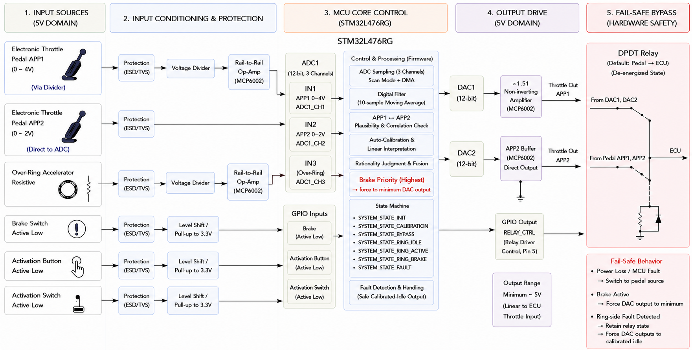
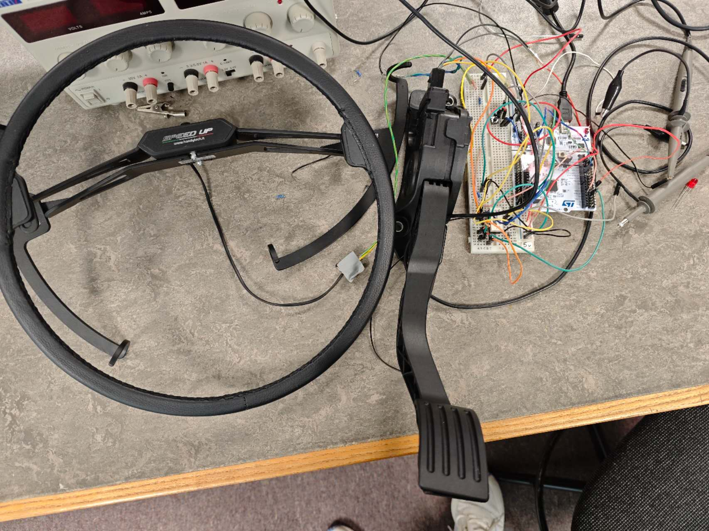
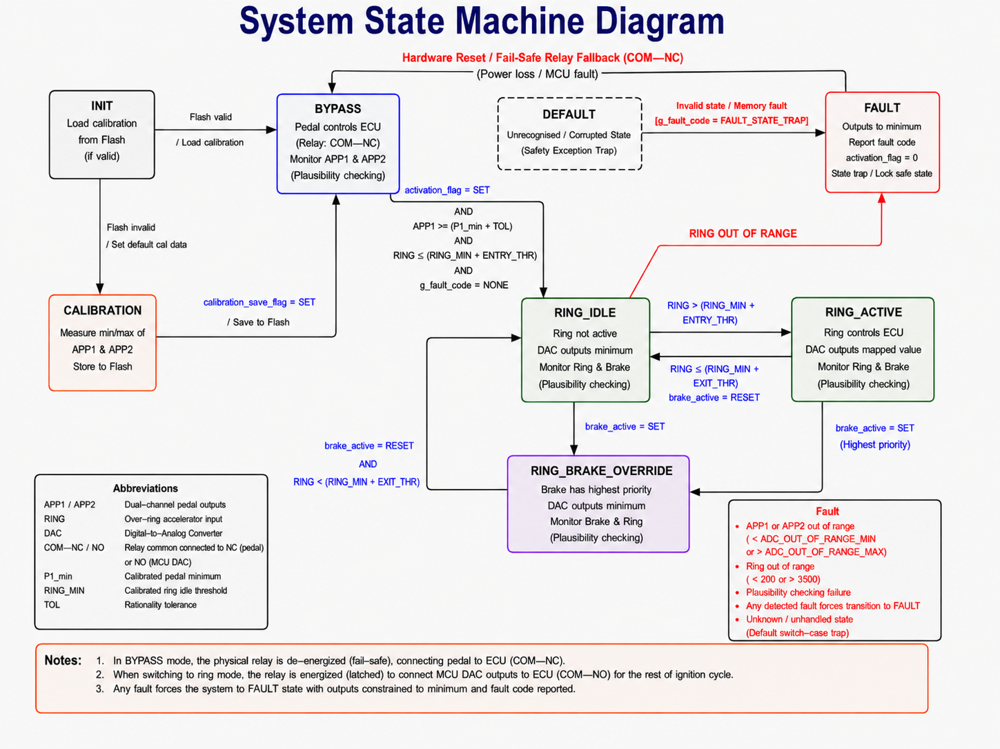
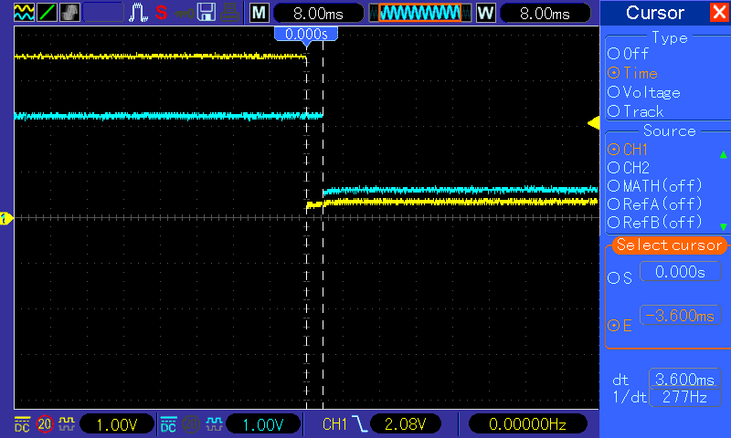
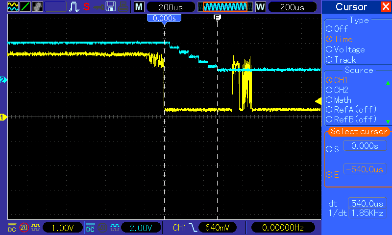

# Smart Accelerator Control

### STM32-Based Dual-Source Accelerator Interface with Brake Priority and Fail-Safe Control

An embedded control prototype based on the **STM32L476RG**, designed to manage a conventional dual-channel electronic accelerator pedal and a hand-operated over-ring accelerator.

The system combines real-time ADC/DMA acquisition, signal filtering, dual-channel throttle reconstruction, brake-priority control, plausibility checking, automatic calibration, fault handling, and hardware fail-safe source switching.

Developed as part of my **MSc Electronics and Information Technology** dissertation at the **University of South Wales**.

> **Note:** This is an academic laboratory prototype. It has not been validated or certified for use in a production vehicle or on public roads.

---

## Key Features

- STM32L476RG ARM Cortex-M4
- Embedded C / STM32 HAL
- 3-channel ADC acquisition
- DMA circular buffer
- 10-sample moving-average filter
- Dual 12-bit DAC outputs
- Automatic pedal endpoint calibration
- Internal Flash parameter storage
- APP1 / APP2 plausibility checking
- Ring sensor range monitoring
- Finite State Machine (FSM)
- Brake-priority override
- Ring-input hysteresis
- Fault-state handling
- Fixed-point output mapping
- Normally-closed DPDT relay fail-safe bypass
- Oscilloscope-based timing validation
- Fault injection testing

---

## System Architecture

```text
Electronic Pedal ─────┐
APP1 / APP2            │
                      ├──> Signal Conditioning
Ring Accelerator ──────┘          |
                                   v
                            STM32L476RG
                         +----------------+
Brake Switch ─────────> | ADC + DMA      |
                         | Filtering      |
Activation ───────────> | Calibration    |
                         | Plausibility   |
                         | State Machine  |
                         | Fault Handling |
                         | DAC Mapping    |
                         +-------+--------+
                                 |
                            DAC1 / DAC2
                                 |
                       Analogue Output Stage
                                 |
                             DPDT Relay
                                 |
                                 v
                                ECU
```



*Overall architecture of the prototype.*

---

## Hardware Prototype

The system was implemented and tested as a laboratory breadboard prototype.



Main hardware:

- STM32L476RG Nucleo board
- Dual-channel electronic accelerator pedal
- Over-ring accelerator
- MCP6002 operational amplifier
- DPDT relay
- BC548B transistor relay driver
- Flyback diode
- Voltage-divider networks
- Brake switch
- Activation and calibration switches

---

## Firmware Design

The firmware is organised around seven system states:

```text
INIT
CALIBRATION
BYPASS
RING_IDLE
RING_ACTIVE
RING_BRAKE_OVERRIDE
FAULT
```

The original pedal is the default accelerator source.

Ring control is only enabled when:

- the pedal is near its calibrated idle position
- the ring accelerator is near idle
- a valid activation request is present
- no relevant system fault is active

A brake input overrides ring acceleration and forces both DAC outputs toward their calibrated idle values.

The ring accelerator must return to idle before acceleration can resume after braking.



*Finite state machine used for source arbitration and fault handling.*

---

## ADC and DMA Data Acquisition

Three analogue signals are continuously acquired:

- APP1
- APP2
- Ring accelerator

The ADC operates in continuous scan mode and DMA transfers the conversion results directly into memory.

```text
APP1 -> APP2 -> RING -> APP1 -> APP2 -> RING -> ...
```

DMA operates in **circular mode**, allowing new samples to continuously replace old samples without requiring the CPU to poll every conversion.

A **10-sample moving-average filter** is applied to reduce noise and transient variation.

---

## Automatic Calibration

Different accelerator pedals can use different idle and maximum output voltages.

The firmware therefore calibrates:

```text
APP1 minimum
APP1 maximum
APP2 minimum
APP2 maximum
```

The calibrated values are stored in internal Flash memory.

At startup, the firmware checks the stored calibration data before normal operation.

```text
Power On
   |
   v
 INIT
   |
   v
Read Calibration
   |
   +------ Valid ------> BYPASS
   |
   +----- Invalid -----> CALIBRATION
```

A startup delay is used before calibration to avoid recording unstable sensor values during initial power-up.

---

## Pedal Plausibility Checking

The electronic pedal provides two position channels: APP1 and APP2.

Both channels are normalised using their calibrated minimum and maximum values.

Conceptually:

```text
             APPcurrent - APPmin
Travel = ----------------------------- × 100%
               APPmax - APPmin
```

The controller compares the calculated travel of both channels.

The firmware can identify conditions associated with:

- APP out-of-range values
- APP1 / APP2 travel mismatch
- open circuits
- short circuits
- abnormal pedal signals

If a pedal fault is detected while operating in BYPASS mode, activation of ring control is inhibited.

---

## Brake Priority

The brake input has the highest priority while ring control is active.

```text
RING_ACTIVE
     |
   Brake
     |
     v
RING_BRAKE_OVERRIDE
     |
     v
DAC1 -> Idle
DAC2 -> Idle
```

Releasing the brake does not immediately restore a previous throttle demand.

The ring accelerator must first return to its idle region before normal acceleration can resume.

This helps prevent an unintended throttle step after braking.

---

## Ring Accelerator Hysteresis

Separate thresholds are used when entering and leaving the active ring state.

```text
Ring Increasing:
RING_IDLE -> RING_ACTIVE
at ENTRY threshold

Ring Decreasing:
RING_ACTIVE -> RING_IDLE
at EXIT threshold
```

Using separate entry and exit thresholds reduces rapid state switching caused by input noise close to a single threshold.

---

## Dual-Channel Output Mapping

The ring accelerator provides one throttle-demand signal, while the ECU expects two related accelerator signals.

The firmware therefore maps ring travel independently into the calibrated APP1 and APP2 ranges.

```text
                 Ring Travel
                      |
             +--------+--------+
             |                 |
             v                 v
        APP1 Mapping      APP2 Mapping
             |                 |
            DAC1              DAC2
             |                 |
        Amplifier          Direct Output
             |                 |
             +--------+--------+
                      |
                      v
                     ECU
```

APP1 uses an external MCP6002 non-inverting amplifier because the required output range can exceed the native STM32 DAC voltage range.

---

## Hardware Fail-Safe

A normally-closed DPDT relay physically selects the accelerator source.

### Normal / Bypass Mode

```text
Electronic Pedal
       |
       v
    Relay NC
       |
       v
      ECU
```

The original pedal is the default physical signal path.

### Ring Mode

```text
STM32 DAC Outputs
       |
       v
    Relay NO
       |
       v
      ECU
```

### MCU Power Loss

```text
MCU Power Loss
      |
      v
Relay De-energises
      |
      v
COM returns to NC
      |
      v
Original Pedal Restored
```

The fallback does not depend on continued MCU software execution.

---

## Test Results

The prototype was evaluated using an oscilloscope, digital multimeter and controlled fault injection.

| Test | Target | Measured Result | Status |
|---|---:|---:|:---:|
| DAC1 brake response | < 20 ms | **3.7 ms** | PASS |
| DAC2 brake response | < 20 ms | **3.6 ms** | PASS |
| Ring sensor fault response | < 50 ms | **~540 µs** | PASS |
| MCU power-loss pedal fallback | Hardware fallback | **5.45 ms** | PASS |
| Maximum output mapping error | ±2% FSS | **1.51% FSS** | PASS |

---

## Brake Override Test

The measured brake response was approximately:

```text
DAC1 / APP1 channel: 3.7 ms
DAC2 / APP2 channel: 3.6 ms
```

Both channels remained well below the project's 20 ms brake-response target.



*Oscilloscope measurement of brake override response.*

---

## Ring Sensor Fault Test

Open-circuit and short-circuit conditions were injected while ring control was active.

```text
Abnormal Ring Input
        |
        v
Fault Detection
        |
        v
FAULT State
        |
        v
DAC1 -> Idle
DAC2 -> Idle
```

Measured fault response:

**~540 µs**



*Example fault response measurement.*

---

## Power-Loss Fail-Safe Test

MCU power was removed while the controller was operating.

The relay de-energised and restored the normally-closed pedal signal path.

Measured restoration time:

**5.45 ms**


*Hardware fallback after controller power removal.*

---

## Output Mapping Accuracy

Repeated measurements were performed across different throttle positions.

The maximum measured output mapping deviation was:

**1.51% FSS**

Across the 25% to 100% throttle range, both channels remained within approximately:

**1.0% FSS**

The maximum measured standard deviation across repeated measurements was approximately:

**3.2 mV**


*Measured APP output mapping compared with target values.*

---

## Validation Examples

| Test Condition | Expected Behaviour | Result |
|---|---|:---:|
| Activation with pedal above idle | Remain in BYPASS | PASS |
| Activation with ring above idle | Remain in BYPASS | PASS |
| Valid activation | Enter RING_IDLE | PASS |
| Brake during RING_ACTIVE | Clamp outputs to idle | PASS |
| Brake released while ring remains pressed | Maintain idle output | PASS |
| MCU power removed | Restore pedal NC path | PASS |
| APP1 open circuit | Inhibit ring activation | PASS |
| APP2 abnormal high input | Inhibit ring activation | PASS |
| APP1 / APP2 mismatch | Detect plausibility fault | PASS |
| Ring open circuit | Enter FAULT | PASS |
| Ring short circuit | Enter FAULT | PASS |
| Invalid Flash calibration | Enter CALIBRATION | PASS |

---

## Development Tools

### Firmware

- C
- STM32 HAL
- STM32CubeMX
- STM32CubeIDE
- STM32 Programmer

### Hardware / Testing

- STM32L476RG Nucleo
- MCP6002
- DPDT relay
- BC548B transistor
- Oscilloscope
- Digital multimeter
- Breadboard prototype

### Version Control

- Git
- GitHub

---

## Skills Demonstrated

This project demonstrates practical experience with:

- Embedded C
- STM32 firmware development
- ADC
- DMA
- circular buffers
- DAC
- GPIO
- timers and interrupts
- finite state machines
- Flash storage
- moving-average filtering
- fixed-point calculations
- sensor calibration
- hysteresis
- fault handling
- analogue signal conditioning
- operational amplifiers
- transistor relay drivers
- hardware/software integration
- real-time response measurement
- safety-oriented embedded design

---

## Repository Structure

```text
Smart-Accelerator-Control/
│
├── Core/
│   ├── Inc/
│   └── Src/
│
├── Drivers/
│
├── images/
│   ├── hardware-overview.jpg
│   ├── system-architecture.png
│   ├── state-machine.png
│   ├── brake-override.png
│   ├── fault-response.png
│   ├── power-loss-fallback.png
│   └── output-mapping.png
│
├── README.md
│
└── STM32 project files
```

---

## Current Limitations

This system is a laboratory prototype rather than an automotive-qualified controller.

The current implementation has not undergone:

- automotive EMC qualification
- environmental qualification
- production PCB validation
- vehicle-level ECU compatibility testing
- automotive functional-safety certification
- production reliability testing

The prototype also does not currently include:

- Independent Watchdog supervision
- relay-contact feedback
- closed-loop DAC output monitoring
- CRC-protected calibration storage

---

## Future Improvements

Possible future development includes:

- STM32 Independent Watchdog (IWDG)
- relay position feedback
- closed-loop analogue output monitoring
- CRC-protected Flash calibration data
- automotive-grade PCB design
- protected automotive power supply
- improved transient protection
- EMC testing
- environmental testing
- vehicle-level ECU integration testing

---

## Academic Context

This repository is based on my MSc individual project:

**STM32-Based Smart Control Interface for Dual-Source Accelerators with Integrated Brake Priority System**

MSc Electronics and Information Technology  
University of South Wales  
Academic Year 2025/2026

The repository focuses on the engineering implementation and portfolio presentation of the project.

The full dissertation is not included.

---

## Author

**Yuanchen Zhang**

MSc Electronics and Information Technology  
University of South Wales

GitHub: [YuanchenZhang2002](https://github.com/YuanchenZhang2002)

---

## Disclaimer

This project is provided for academic, educational and portfolio purposes only.

The system has only been evaluated as a laboratory prototype and has not undergone vehicle-level validation, automotive certification, EMC qualification, or production functional-safety assessment.

**Do not use this prototype to control a road vehicle.**
